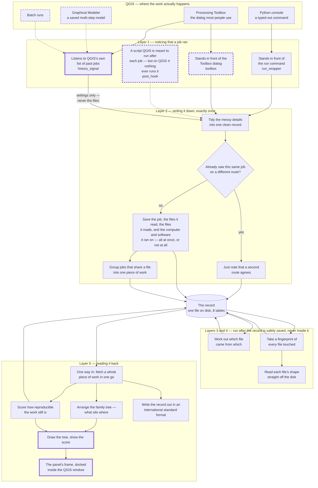

# GeoProvenance — system architecture

**What this file is.** The system as it has actually been built: how the parts fit
together, which file each part lives in, who owns it, and whether anyone has proved it on a
real machine.

Every box maps to a file that exists and every arrow to a call that is really made. Where
something has been written but never proven on a real machine, it is drawn with a **dashed
outline** and says so — `RULES.md` §11.4.

**Who it is for.** A reviewer or examiner who has never used QGIS, alongside the two
developers who need the real file paths. The diagram uses plain words; the mapping table
under it gives the file, the owner and the status.

**Notes on scope.** This follows the five layers of [`EXPLAINER.md`](./EXPLAINER.md) §2 —
the ones mapped to real files — not the six of `geoprovenance_research.md` §4.3, whose
Layer 6 (workflow replay) is an unassigned stretch goal with no code behind it. This file
is not a `RULES.md` §11.1 deliverable; it exists because the only architecture picture the
project had was drawn before the code and no longer matches it (see §2).

**Companion diagrams:** [`DFD.md`](./DFD.md) (how information moves) ·
[`USE_CASES.md`](./USE_CASES.md) (what a person can do with it).

**Last checked against the code:** 1 September 2026.

---

## 1. How the parts fit together

Work flows down. Each layer only knows about the one above it.

**Legend.** A **dashed** outline or arrow means *written, but never proven on a real
machine* — see the status column below. A **thick** outline means that part needs QGIS or
its window toolkit actually running. Everything else works on plain Python dictionaries and
asks an object what it can do rather than what it is, so it can be tested on a laptop with
no GIS software installed at all. That is the reason 537 tests pass here while only the
thin adapters at the edges remain unproven.

### What each box is

| In the picture | File | Layer | Owner | Status |
|---|---|---|---|---|
| Stands in front of the run command | `capture/hooks.py` · `install_run_wrapper` | 1 | A | **Measured live** 24 Aug 2026 — caught 4 of 4 |
| Stands in front of the Toolbox dialog | `capture/hooks.py` · `install_toolbox_wrapper` | 1 | A | `UNVERIFIED:` written 26 Aug 2026 with 20 tests, none needing QGIS. Confirmed by re-running a Toolbox job with it live and reading `channel_statistics()` |
| Listens to QGIS's own list of past jobs | `capture/history_observer.py` | 1 | A | **Fired live** 26 Aug 2026 — but holds no algorithm, so it attaches **no files** and its start and end times are identical |
| A script QGIS is meant to run after each job | `capture/hooks.py` · `install_post_execution_hook` | 1 | A | **Verified absent on QGIS 4** — caught 0 of 4. Untested on the 3.34 target and unknowable from this evidence |
| Leaves a start time behind | `capture/hooks.py` · `handle_pre_execution` | 1 | A | Same as above — it only matters if the post-run script runs |
| Tidy the messy details | `capture/normalizer.py` | 2 | A | Tested, no QGIS needed |
| Already saw this same job? | `capture/engine.py` · `_find_duplicate` | 2 | A | Tested. Keyed on the raw settings, matched inside a 2-second window |
| Save it all at once, or not at all | `capture/engine.py` · `_insert_event` → `storage/store.py` | 2 | A | Tested, no QGIS needed |
| Note the computer and software | `capture/environment.py` | 2 | A | Degrades to "unknown" outside QGIS |
| Group jobs into one piece of work | `storage/workflows.py` | 2 | A | 26 tests |
| The record | `storage/schema.sql` · `store.py` · `migrations.py` | 2 | A | 8 tables, 9 indices |
| Take a fingerprint | `fingerprint/hash.py` | 3 | B | Tested. Streams the whole file under 500 MB |
| Read each file's shape off the disk | `fingerprint/readers.py` | 3 | B | Tested. Hand-written readers — no GDAL |
| Work out which file came from which | `prov.py` · `infer_derivations` | 4 | B | Tested against all three sample pieces of work |
| One way in | `storage/store.py` · `get_workflow_graph` | 5 | A | The single read seam — everything below uses it |
| Arrange the family tree | `ui/layout.py` | 5 | C | No Qt, no QGIS — so the branching case is under `make test` |
| Score how reproducible it is | `audit.py` | 5 | C | Five weighted checks. A check that could not be run scores nothing, never full marks |
| Write the record out | `prov.py` · `to_prov_json` / `to_record_json` | 5 | B | Tested |
| Draw the tree, show the score | `ui/panel.py` | 5 | C | **Verified in QGIS 4.2.1** |
| The panel's frame | `ui/dock.py` | 5 | A | **Verified** — 11 of 11 load/unload tests inside QGIS |

Supporting files not drawn, because they hold no data: `plugin.py` (switches everything on
and off), `lifecycle.py` (undoes every change on unload, in reverse order), `paths.py`
(where the record file lives), `log.py` (messages into QGIS's log panel).

### The four routes, and why there are four

The Toolbox does not go through the run command, and the run command does not go through
the Toolbox. Neither of them fires the script QGIS's own documentation says runs after
every job — on QGIS 4 that mechanism has been removed entirely, and it caught nothing.

> **This is the finding worth reporting.** Building on the documented mechanism alone would
> have captured **nothing at all** on the only QGIS available to test. Installing four
> routes instead of trusting one is what produced 4 of 4.

One job seen by two routes is stored **once**, with a note that a second route agreed. That
note is the evidence for "out of N jobs, how many did we notice?", so it is read from the
record rather than counted in a log.

---

## 2. How this differs from the research report's own diagram

`geoprovenance_research.md` §5.1 holds an architecture diagram drawn **before** the code.
It is wrong in five specific ways, and `README.md` currently defines who owns what by
pointing at its boxes. The research report is **left as it stands** and the departure is
recorded here — the same treatment given to its §7.3 example on 31 August 2026.

| §5.1 shows | What was actually built | Proof |
|---|---|---|
| Two ways of noticing a job | **Four** | `storage/schema.sql:62` |
| The after-the-job script as the main mechanism | It **does not exist on QGIS 4** and caught 0 of 4; the run-command wrapper carried everything | `capture_coverage.md` §1 |
| Fingerprinting and family-tree work happening *between* tidying and saving | Both run **after** the record is saved, reading it back — so a failure in either can never cost the user their record | `capture/engine.py` `_fingerprint`, `_infer_derivations` |
| Six boxes of stored information, including a settings table | **Eight tables**, and there is no separate settings table; three tables are missing from the picture | `storage/schema.sql` |
| One drawing box, and one export format | The drawing is split into arrangement and painting, and there are two export formats | `ui/layout.py`, `ui/panel.py`, `prov.py` |

The split between arrangement and painting is not tidiness. Arranging a family tree needs no
Qt and no QGIS, so keeping it separate is what puts the branching case — a file made by one
job and read by two others — under `make test` on any machine, and what lets a walkthrough
print exactly the tree the panel draws.

---

## Where to go next

| You want | Read |
|---|---|
| How information moves through it | [`DFD.md`](./DFD.md) |
| What a person can do with it | [`USE_CASES.md`](./USE_CASES.md) |
| The whole system in words, at full depth | [`EXPLAINER.md`](./EXPLAINER.md) |
| What has actually been measured, and what has not | [`capture_coverage.md`](./capture_coverage.md) |
| The exact shape of the record | [`CONTRACT_schema.md`](./CONTRACT_schema.md) |
| The exact shape of one captured job | [`CONTRACT_event.md`](./CONTRACT_event.md) |
| Running the plugin in QGIS by hand | [`RUNNING_IN_QGIS.md`](./RUNNING_IN_QGIS.md) |
| The research background and literature review | [`../geoprovenance_research.md`](../geoprovenance_research.md) |
