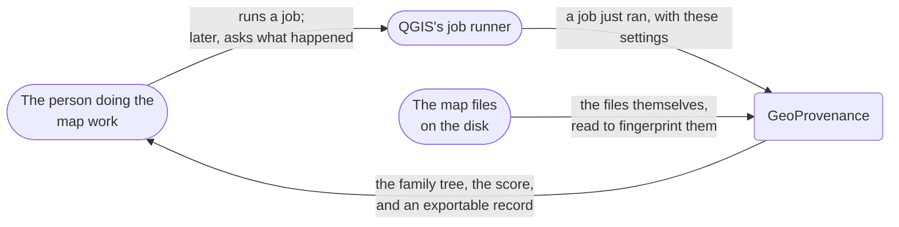
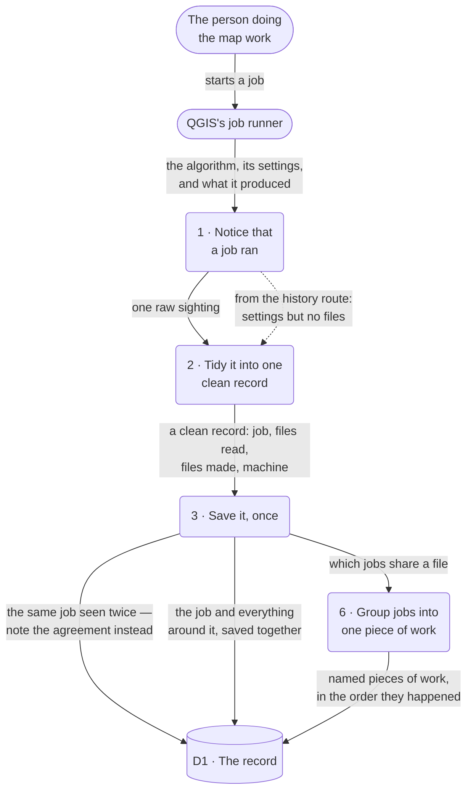
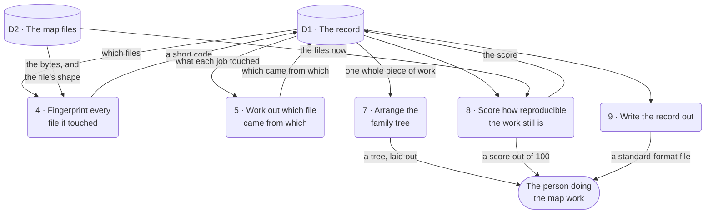

# GeoProvenance — data flow

**What this file is.** How information moves through the system as it has actually been
built: what comes in from outside, what each step does to it, where it rests, and what
comes back out.

Every process maps to a file that exists and every arrow to a call that is really made.
Where something has been written but never proven on a real machine, it is drawn with a
**dashed** arrow and says so — `RULES.md` §11.4.

**Who it is for.** A reviewer or examiner who has never used QGIS, alongside the two
developers who need the real file paths. The diagrams use plain words; the table in §4
gives the file behind each numbered process.

**Notes on scope.** This follows the five layers of [`EXPLAINER.md`](./EXPLAINER.md) §2 —
the ones mapped to real files — not the six of `geoprovenance_research.md` §4.3, whose
Layer 6 (workflow replay) is an unassigned stretch goal with no code behind it. This file
is not a `RULES.md` §11.1 deliverable.

**Companion diagrams:** [`ARCHITECTURE.md`](./ARCHITECTURE.md) (how the parts fit
together) · [`USE_CASES.md`](./USE_CASES.md) (what a person can do with it).

**Last checked against the code:** 1 September 2026.

---

## Notation

Mermaid has no data-flow notation of its own, so this is the standard shape convention
drawn by hand, and held to in all three diagrams below — the whole system from outside,
then one level down, split into the half that records and the half that reads back:

| Shape | Means |
|---|---|
| `( rounded )` | something the system does, numbered |
| `([ stadium ])` | someone or something outside the system |
| `[( cylinder )]` | somewhere information rests |

The level-1 diagram is split in two because the record is a ten-edge hub and one combined
drawing was unreadable. The numbering runs 1–9 across both halves.

---

## 1. Context — the whole system, from outside

Nothing flows from GeoProvenance back into the job runner or the files. It only ever
watches and reads — it never changes a map file, and it never alters a job.

---

## 2. Level 1, part one — from a job to a saved record

**The one asymmetry worth noticing.** The dashed arrow into process 2 is the history route.
It carries the settings but no files, because it never holds the algorithm itself and so
cannot tell a setting that names a file from a setting that is just a number. A job caught
*only* that way records **that** it happened and nothing about **what** it touched. This is
the whole reason a fourth route was added for the Toolbox.

---

## 3. Level 1, part two — what happens once it is saved

Steps 4 and 5 run **after** the record is safely saved, reading it back rather than sitting
inside the save. That ordering is deliberate: a failure while fingerprinting can then cost
a fingerprint, never the record of the job itself.

---

## 4. What each process is

| # | In the picture | File | Owner |
|---|---|---|---|
| 1 | Notice that a job ran | `capture/hooks.py` · `capture/history_observer.py` | A |
| 2 | Tidy it into one clean record | `capture/normalizer.py` · `capture/environment.py` | A |
| 3 | Save it, once | `capture/engine.py` → `storage/store.py` | A |
| 4 | Fingerprint every file it touched | `fingerprint/hash.py` · `fingerprint/readers.py` | B |
| 5 | Work out which file came from which | `prov.py` · `infer_derivations` | B |
| 6 | Group jobs into one piece of work | `storage/workflows.py` | A |
| 7 | Arrange the family tree | `ui/layout.py` → `ui/panel.py` | C |
| 8 | Score how reproducible the work still is | `audit.py` · `fingerprint/compare.py` | C |
| 9 | Write the record out | `prov.py` · `to_prov_json` / `to_record_json` | B |

Everything reaching processes 5, 7, 8 and 9 comes through one read seam,
`storage/store.py` · `get_workflow_graph`. There is no second way in.

## Where the information rests

**D1, the record** — one file, eight tables: the files being tracked, the jobs that ran, the
machines they ran on, the fingerprints, the links between everything, the named pieces of
work, which job belongs to which, and the scores. Detail in
[`CONTRACT_schema.md`](./CONTRACT_schema.md).

**D2, the map files** — read, never written.

## The worked example everything is built from

`roads.shp` → **Buffer 500 m** → `buffered_roads.shp` → **Clip by `city_boundary.shp`** →
`final_roads.shp`.

Three files came in and out of two jobs, so the record holds: two jobs, four files, one
machine, and the links between them — including **`final_roads.shp` came from
`city_boundary.shp`**, not only from `buffered_roads.shp`. The clip result depends on the
boundary as surely as on the roads, and the score's "did the starting files change?" check
is exactly the claim that link makes. The same chain drives the sample data and all three
walkthroughs.

---

## Where to go next

| You want | Read |
|---|---|
| How the parts fit together | [`ARCHITECTURE.md`](./ARCHITECTURE.md) |
| What a person can do with it | [`USE_CASES.md`](./USE_CASES.md) |
| The whole system in words, at full depth | [`EXPLAINER.md`](./EXPLAINER.md) |
| What has actually been measured, and what has not | [`capture_coverage.md`](./capture_coverage.md) |
| The exact shape of the record | [`CONTRACT_schema.md`](./CONTRACT_schema.md) |
| The exact shape of one captured job | [`CONTRACT_event.md`](./CONTRACT_event.md) |
| Running the plugin in QGIS by hand | [`RUNNING_IN_QGIS.md`](./RUNNING_IN_QGIS.md) |
| The research background and literature review | [`../geoprovenance_research.md`](../geoprovenance_research.md) |
