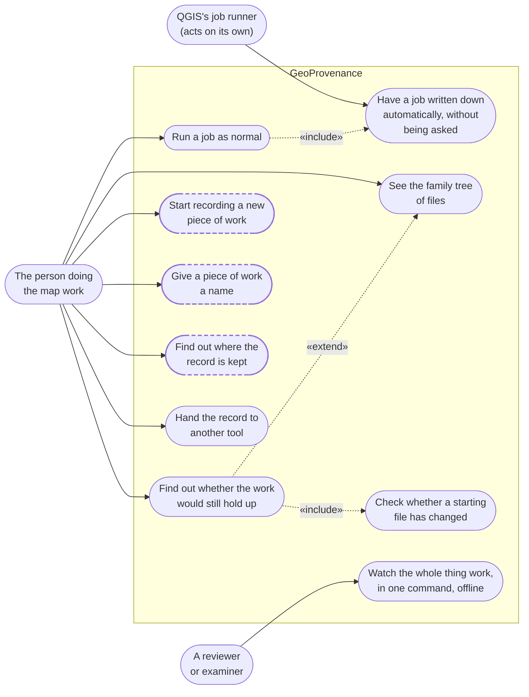

# GeoProvenance — use cases

**What this file is.** What a person can actually do with the system as built: who each
capability is for, how it is reached, and whether anyone has yet done it on a real machine.

Where something has been written but nobody has ever exercised it, it is drawn with a
**dashed outline** and says so — `RULES.md` §11.4.

**Who it is for.** A reviewer or examiner who has never used QGIS, alongside the two
developers who need the real file paths.

**Notes on scope.** This covers the five layers of [`EXPLAINER.md`](./EXPLAINER.md) §2 —
the ones mapped to real files — not the six of `geoprovenance_research.md` §4.3, whose
Layer 6 (workflow replay) is an unassigned stretch goal with no code behind it. This file
is not a `RULES.md` §11.1 deliverable.

**Companion diagrams:** [`ARCHITECTURE.md`](./ARCHITECTURE.md) (how the parts fit
together) · [`DFD.md`](./DFD.md) (how information moves).

**Last checked against the code:** 1 September 2026.

---

## 1. What a person can do with it

Mermaid has no use-case notation either. Actors are on the left, the box is the system
boundary, each rounded capsule is one thing you can do, and a dotted arrow marked
`«include»` means *this always happens as part of that*.

### The three actors

| Actor | Who or what it is |
|---|---|
| The person doing the map work | The QGIS user. Does nothing differently — that is the point |
| QGIS's job runner | Not a person. It triggers the recording on its own, which is why the first capability has no human attached to it |
| A reviewer or examiner | Someone who needs to see the whole thing work without installing QGIS |

## 2. What each one is, and whether anyone has done it

| You can | How it is reached | Status |
|---|---|---|
| Have a job written down automatically | No user action at all — four routes, `capture/hooks.py` and `capture/history_observer.py` | **Done live**, 4 of 4, 24 Aug 2026 |
| Run a job as normal | Nothing changes for the user; that is the point | Every piece of capture code is wrapped so a failure inside it can never break the job |
| See the family tree of files | Menu → **Show GeoProvenance panel**, first tab | **Verified in QGIS 4.2.1** |
| Find out whether the work would still hold up | Same panel, **Can we run it again?** tab | Score out of 100, plus which check let it down |
| Check whether a starting file has changed | Part of the score — `fingerprint/compare.py` | Six answers, not one bit: unchanged, re-saved, values changed, shapes changed, structure changed, changed |
| Start recording a new piece of work | Menu → **Start new workflow** | `UNVERIFIED:` nobody has clicked it |
| Give a piece of work a name | Menu → **Name this workflow…** | `UNVERIFIED:` nobody has clicked it |
| Find out where the record is kept | Menu → **Provenance database…** | `UNVERIFIED:` nobody has clicked it |
| Hand the record to another tool | `prov.py` — an international standard format | Tested. Not yet wired to a menu item |
| Watch the whole thing work, offline | `make demo1`, `make demo2`, `make demo-workflow` | **Passing.** One command, no QGIS, no prior knowledge needed |

> **Why three menu items are dashed.** Until 26 August 2026 the install step put the plugin
> in a folder QGIS 4 does not read, so it had never once appeared in the plugin list. That
> is now fixed and the plugin loads — but nobody has yet clicked those three dialogs.
> Confirming them is three clicks, written up in
> [`RUNNING_IN_QGIS.md`](./RUNNING_IN_QGIS.md).

---

## Where to go next

| You want | Read |
|---|---|
| How the parts fit together | [`ARCHITECTURE.md`](./ARCHITECTURE.md) |
| How information moves through it | [`DFD.md`](./DFD.md) |
| The whole system in words, at full depth | [`EXPLAINER.md`](./EXPLAINER.md) |
| What has actually been measured, and what has not | [`capture_coverage.md`](./capture_coverage.md) |
| The exact shape of the record | [`CONTRACT_schema.md`](./CONTRACT_schema.md) |
| The exact shape of one captured job | [`CONTRACT_event.md`](./CONTRACT_event.md) |
| Running the plugin in QGIS by hand | [`RUNNING_IN_QGIS.md`](./RUNNING_IN_QGIS.md) |
| The research background and literature review | [`../geoprovenance_research.md`](../geoprovenance_research.md) |
